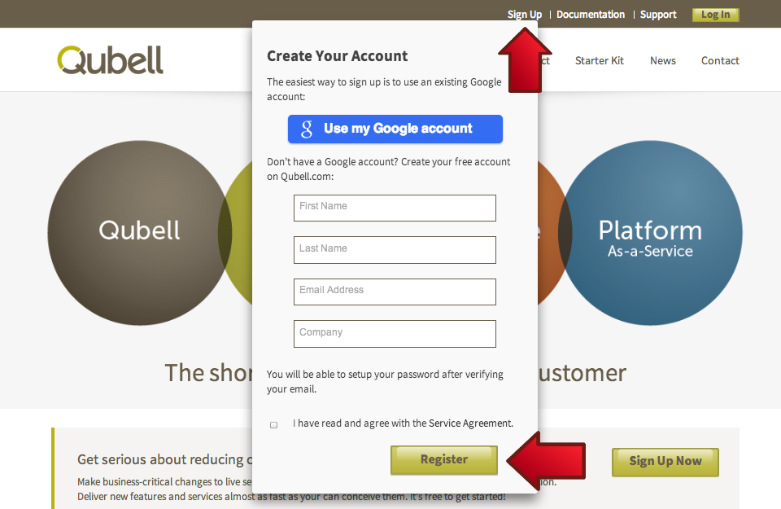
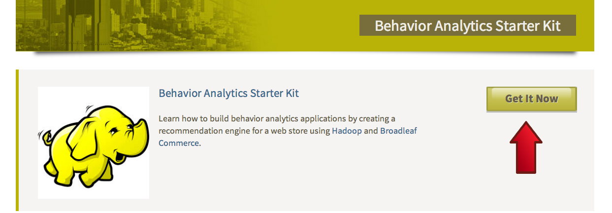

Chapter 2: Getting Started
===========================
In this chapter we’ll perform all configuration and set-up steps necessary to get our starter kit up running. Along the way we’ll introduce basic concepts of Qubell Adaptive PaaS technology used by managing all aspects of deployment and management of your recommendation engine.

In order to start working with the starter kit, you need to perform the following steps:
- Set-up your Qubell account
- Import Behavior Analytics Starter Kit 
- Set-up Amazon account
- Configure deployment environment

Let’s walk through these three steps in details. 

Set-up Qubell Account
---------------------
To open a free account on Qubell, please go to [Qubell.com](http://qubell.com/) and click on “Sign Up” from the top menu. Follow the instructions to create an account. If you have an account, skip this step. 

Volla! You are inside the user portal of Qubell Adaptive PaaS. We are going to use this portal extensively while we work with the Kit. Although we’ll inject detailed instructions on how to use Qubell for all standard functions of the starter kit, you may want to take a minute to familiarize yourself with Qubell Adaptive PaaS technology. Here is a quick reference guide:
- Core concepts
- Manifest developer’s guide
- Action reference
- API 1.3 reference
- Administrator’s guide

Import Behavior Analytics Kit
-----------------------------
Now that you have the account on Qubell, let’s import the content of the Starter Kit into your Qubell portal. This Starter Kit is published on Qubell web site, amongst other starter kits.
- Go to [http://qubell.com/starter-kits/BASK](http://qubell.com/starter-kits/BASK)
- Click “Get It Now” 

- Login to Qubell

- Provide the following values to the fields:
  - TBW
  - TBW

Congratulation, you have successfully imported the elements of the starter kit into your account. To verify, you should see two applications on your Application tab:

You are almost ready to launch your applications - as soon as you provide and configure some sort of physical environment for the applications to run on. This kit was developed to run on Amazon EC2 and S3 cloud services, so you’ll need to have an Amazon account to move forward. Later, we will discuss how to customize this kit so that it can run on any infrastructure, including another public cloud, a private cloud or even bare metal servers in your datacenter. 

Set-up Amazon account
---------------------
Since you’ll be deploying the analytics and sample web store on Amazon cloud, you need to have an account on Amazon, configure its security group to allow traffic to your applications and then add that Amazon account to your Qubell portal. 
- **Obtain Amazon EC2 account capable of creating EC2 nodes and use S3 service.** If you don’t yet have an account on Amazon, it can be done here. If you already have one, move to the next step
- **Set-up security group.** The EC2 security group “default” has to allow connections to the application you’ll be deploying using your account. Below is the list of ports that have to be open for each application or service using the [Amazon portal](http://docs.aws.amazon.com/AWSEC2/latest/UserGuide/using-network-security.html#adding-security-group-rule): 
  - 22 (TCP, SSH)
  - 80 (TCP, HTTP of httpd)
  - 443 (TCP, НTTPS of httpd)
  - 8080 (TCP, Tomcat)
  - 8649 (TCP and UDP, Ganglia)
  - 8020 (TCP, NameNode DFS)
  - 50070 (TCP, HTTP of NameNode WebUI)
  - 8021 (TCP, JobTracker)
  - 50030 (TCP, HTTP of JobTracker WebUI)
  - 50010 (TCP, DataNode DFS)
  - 50020 (TCP, DataNode IPC)
  - 50075 (TCP, HTTP of DataNode WebUI)
  - 50060 (TCP, HTTP of TaskTracker WebUI)

Introduction to Qubell Platform Concepts
----------------------------------------
Before we go any further, let’s understand how application deployment happens in Qubell. Qubell is designed to make it easy for developers to deploy complex distributed applications - multi-tiered web stores or Hadoop clusters - for different purposes, such as development, testing and production. 
  Application is always deployed into some environment - such as dev, qa or production.  The details of where that environment is located and what kind of infrastructure is used is not necessary to know in order to launch application. Different environments may operate on different clouds, reside in different datacenters and use different services. Once the environment has been set-up, Qubell will take care that applications can be launched into any compatible environment. Compatibility between an application and an environment means that if that application requires a certain service, the environment must have a such a service available for the application. Qubell validates the compatibility of application and environment at launch. Services come in three types:
- **Cloud accounts-** This is a special type of service reserved for public cloud accounts, such as Amazon EC2 or Rackspace. If your application expects a cloud, it will not be deployed into an environment that doesn’t have one.
- **Markers-** Marker is another special type of service that simply indicates whether some service is present in the environment. For example, “Mainframe connection” might be a marker that signals the availability of the mainframe end-point in a particular environment. 
- **Services-** These can be anything, from a pool of VMs to a database with customer records. We are going to use one service called Secure Vault. Secure Vault is an encrypted store that holds your private information such as Amazon credentials and SSH keys. This way applications can safely store, retrieve and use secret data. 

A platform is a central repository of definitions of services available across all environments. The lifecycle of a service starts by being added to the platform, then enabled in some environments as appropriate. 
  Besides different services, environments may have properties and policies. Both properties and policies look like key-value pairs defined for each environment, but they are used for different purposes:
- **Properties** are used by Qubell to store parameters necessary to complete application deployment, configuration and management. For example, “db_connection_string = jdbc://somewhere” is a parameter needed by the application to resolve the location of the database driver in this particular environment. We will use properties to pass the location of files stored on S3 between the web store and the analytic engine.
- **Policies** overwrite the values of parameters defined by the application. Different environments may impose different rules on the application. For example, while “test” environment may be configured to offer a choice of Ubuntu or CentOS for an operating system, the “production” environment may allow only RHEL. We are going to define a few policies related to the cloud account. 

It must be clear now that before any application can be launched, there has to be at least one environment set-up, and that environment ought to have all services required by the application.
Armed with theory, we are ready to configure our application deployment environment.  

Add Your Amazon Account to the Platform
---------------------------------------
To be written

Add Secure Vault Service to the Platform
----------------------------------------
To be written

Create “Test” Environment
-------------------------
To be written

Add Amazon cloud to “Test” environment
--------------------------------------
To be written

Add Secure Vault Service to “Test” Environment
----------------------------------------------
To be written

Generate and Store SSH Keys
---------------------------
To be written

Add Properties to “Test” Environment
------------------------------------
To be written

Add Policies to “Test” Environment
----------------------------------
To be written

Congratulations, you’ve successfully completed the set-up and ready to start using the Starter Kit.

**Next Chapter:** [Chapter 3- Working with the Web Store](Chapter%203.md)
